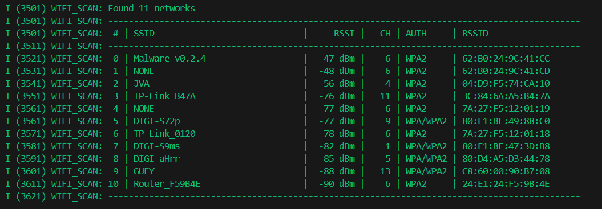

# ESP32 Wi-Fi Scanner (ESP-IDF)

This project demonstrates how to scan and list nearby Wi-Fi networks using the ESP32 and the [ESP-IDF](https://docs.espressif.com/projects/esp-idf).  
It uses the ESP-IDF Wi-Fi driver in station mode to perform active scans and prints a formatted table with the results.

---

## Features

- Initializes the ESP32 Wi-Fi stack in **station mode**.
- Performs **active scans** across all Wi-Fi channels.
- Lists:
  - SSID (or `NONE` if hidden)
  - RSSI (signal strength in dBm)
  - Channel number
  - Authentication mode
  - BSSID (MAC address)
- Outputs results in a clean, tabular format using `ESP_LOGI`.
- Repeats scanning every 3 seconds to show changes in real time.

---

## Example Output

